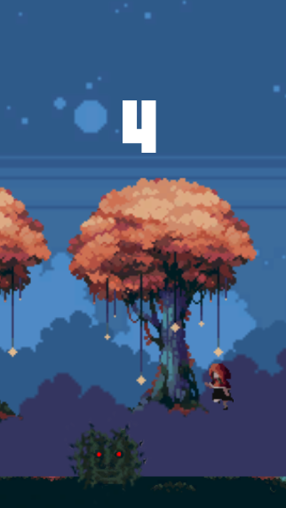

# Night Runner

A 2D endless runner game developed as a personal C# project.

Night Runner is inspired by the simple gameplay concept of the Chrome Dinosaur game. The player controls a character running through an endless environment and must avoid obstacles by jumping.

## Features

- Character movement and jumping
- Collision detection
- Rigidbody-based physics and gravity
- Dynamic obstacle spawning
- Automatic destruction of objects outside the playable area
- Increasing game speed over time
- Animated background and ground
- Progressive difficulty

## Technologies

- C#
- Unity
- Rigidbody Physics
- Collision Detection
- Object Spawning and Destruction
- Gameplay Programming

## Development

This project was developed to improve my C# programming skills and gain practical experience in gameplay programming, physics, object management, collision handling, and real-time game logic.

## Author

**Selim Donmez**
